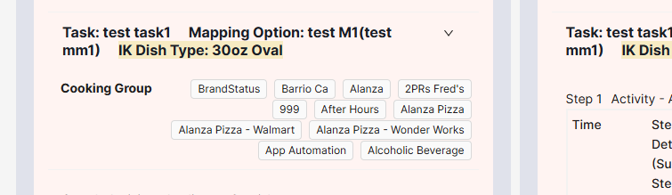

# Front-end Jira Tickets — Assigned to Me

> 更新时间：2026-06-25
> 查询条件：`assignee = currentUser() AND statusCategory != Done`

| Key | 摘要 (Summary) |
|-----|----------------|
| [MD-18176](https://wonder.atlassian.net/browse/MD-18176) | UI - Add cook time and chilling temperature fields to 7* item prep procedure card for Cook & Chill bulk prep |
| [MD-18149](https://wonder.atlassian.net/browse/MD-18149) | UI - IK Support-Component machine eligibility warning and IK step ordering constraint |
| [MD-18150](https://wonder.atlassian.net/browse/MD-18150) | UI - IK Support-Side Component in Specific Dish Type |
| [MD-18175](https://wonder.atlassian.net/browse/MD-18175) | UI - Task Level Cooking Group — KDS routing configuration |
| [MD-18170](https://wonder.atlassian.net/browse/MD-18170) | Auto-select default IK plating rule when step marked as IK eligible |
| [MD-18174](https://wonder.atlassian.net/browse/MD-18174) | UI - Configure IK Portion Conversion at Component Level |
| [MD-18109](https://wonder.atlassian.net/browse/MD-18109) | Remove "Thaw" tag/suffix from all item views |
| [MD-18084](https://wonder.atlassian.net/browse/MD-18084) | Tech UI - Refactor: rewrite AddComponent & AddGuestPackage with antd Form |
| [MD-18151](https://wonder.atlassian.net/browse/MD-18151) | UI - IK support for configuring portion-to-BOM unit conversion for component items |
| [MD-17869](https://wonder.atlassian.net/browse/MD-17869) | UI - Enable Bulk Swap Item from Customization Usages |

---

## 前端需求拆解

### [MD-18176](https://wonder.atlassian.net/browse/MD-18176)

UI - 在 7* item 的 prep procedure card 中，为 Cook & Chill 增加「烹饪时长」和「冷却温度」字段

> 主 ticket：[MD-18172](https://wonder.atlassian.net/browse/MD-18172)

- 在 hdr recipe item 的 prep procedure card 中新增两个可选字段，均为非必填，未填写也可正常提交
- Cook Time（烹饪时长）：Hr / Min / Sec 三段输入，时分秒数值合理
- Chilling Target Temperature（冷却目标温度）：整数输入（支持负数），显示单位 `°F`（如 `45 °F`）
- Change Log 也要加上这两个新字段

### [MD-18149](https://wonder.atlassian.net/browse/MD-18149)

UI - IK 支持：组件 Machine Eligible 警告 + IK step 排序约束

> 主 ticket：[MD-18130](https://wonder.atlassian.net/browse/MD-18130)

**校验 1 — Machine Eligible 组件警告（WARNING，不阻塞保存）**

- 保存 line build 时，对每个 `IK Eligible=true` 的 step，检查其下所有 substep 映射的 component / customization option 是否都带「Machine Eligible」attribute（substep 映射的是 customization option 时，至少有 1 个 item 带 Machine Eligible 即可）
- 若存在未 Machine Eligible 的 Component：弹出确认弹窗，标题 `Are you sure`，正文提示并逐条列出 `Task X - Step Y：{组件编号} {组件名}；{option 名}…`，按钮为 Cancel / Save（不阻塞保存）
- 同样的提示在 line build 详情页的 bad data message 区域展示（逐条列出对应 task-step-组件）

**校验 2 — IK Eligible step 排序约束（ERROR，阻塞保存）**

- 保存含 `IK Eligible=true` step 的 line build 时校验：所有 IK Eligible step 必须排在 task 最前面、且连续（中间不能夹非 IK step）
- 没有映射 component / option 的纯指令 step（instruction-only）不允许出现在 IK Eligible step 之前或之间
- 校验不通过时阻塞保存，弹出错误提示并列出需要移动的 step，如 `Task1-Step1, Step4, Step5`、`Task2-Step1, Step3`

### [MD-18150](https://wonder.atlassian.net/browse/MD-18150)

UI - IK 支持：特定 Dish Type 下的 Side Component（在 task 上新增 IK Dish Type）

> 主 ticket：[MD-18115](https://wonder.atlassian.net/browse/MD-18115)

- 在 line build 的编辑视图和详情视图中，为 task 新增「IK Dish Type」字段，可选
- 选项与 attribute 中的一致：48oz Bowl、32oz Bowl、30oz Oval、Metal Bowl、Bellies Bowl、8oz Cup
- 不论 task 的 mapping option 是否为空、也不论 task 数量多少（即使只有一个 task），都允许 CE 为 task 指定 IK Dish Type；task 级别优先于 menu item 级别
- Change Log 也要加上 task 的 IK Dish Type 字段

### [MD-18175](https://wonder.atlassian.net/browse/MD-18175)

UI - Task 级 Cooking Group（KDS 路由配置）

> 主 ticket：[MD-18165](https://wonder.atlassian.net/browse/MD-18165)

- 在 task 层级、「IK Dish Type」字段旁边新增「Cooking Group」字段，选项与 attribute 中 Cooking Group 的值一致
- 每个 task 支持配置多个 Cooking Group（多选）
- Change Log 也要加上 task 的 Cooking Group 字段，UI 的展示要商量一下
- 

### [MD-18170](https://wonder.atlassian.net/browse/MD-18170)

Auto-select：step 勾选 IK eligible 时自动带出 default IK plating rule

- IK eligible checkbox 从 null → true：把该 step 下所有当前 IK plating rule 为 null 的 substep 自动选为「default」（不论 substep 映射的 item / option 是什么）
- IK eligible checkbox 从 true → null：清空该 step 下所有 substep 的 IK plating rule（default 和 custom 选择都移除）
- 在 IK eligible=true 的 step 下新增 substep 时，自动把 IK plating rule 选为 default；否则不自动选

### [MD-18174](https://wonder.atlassian.net/browse/MD-18174)

UI - 在 Component 级配置 IK Portion Conversion（份量换算）

> 主 ticket：[MD-18167](https://wonder.atlassian.net/browse/MD-18167)

- 在「Usages」card 新增 IK Portion Conversion 区块，点击「Add」打开配置弹窗（交互参考 KDS portion 的配置弹窗），仅需配置一个 `x portion = x g` 的换算，并显示提示 `The IK portion conversion is required for IK Pod.`
- IK Portion Conversion 为 component 级：active final 或 scheduled version 任一改动都会同时作用于两个 version（active 的改动也同步到 draft）；当前为 final 或 scheduled version 时，才在「Add」按钮处以 tip 展示 `The change will be implied in both active and future versions.`
- 当 active final version 已存在时，draft version 中该区块置灰不可编辑，并在「Add」按钮处以 tip 展示 `Please update it in active version.`
- 当 machine eligible=true 时，发布 component 需校验 portion → g 换算必填，缺失则拦截发布并显示 error 提示
- 在 edit attribute 弹窗保存时，遍历属性列表，只要其中有一项 attribute name = 「machine eligible」且值为 yes，就校验当前 item 是否已配置 IK Portion（portion → g 换算）：已配置则直接保存通过、不弹窗；未配置则弹出「配置 IK Portion Conversion」弹窗，用户配置保存后返回 edit attribute 弹窗，点取消同样返回 edit attribute 弹窗
- attribute 值设为 no（或未勾选）时不触发上述校验
- 「配置 IK Portion Conversion」弹窗需做成可复用组件（「Usages」card 常规入口与 edit attribute 联动流程共用）
- Move to variant 场景：variant 中 IK Portion Conversion 区块置灰禁止编辑，提示 `Please maintain it in normal version.`
- Change Log 也要加上 IK Portion Conversion 字段

### [MD-18109](https://wonder.atlassian.net/browse/MD-18109)

移除所有 item 视图中的「Thaw」tag / 后缀

- 在所有 40* item 视图（首页、BOM 视图、item 详情页、搜索结果等）移除 / 隐藏「Thaw」tag / icon
- 创建 thawed 状态的 40* item 时，不再追加「Thaw」后缀
- 清除所有现存 thawed 状态 40* item 名称上的「Thaw」后缀

### [MD-18151](https://wonder.atlassian.net/browse/MD-18151)（暂时不做）

UI - IK 支持：为 component item 配置 portion → BOM unit 换算校验

> 主 ticket：[MD-18122](https://wonder.atlassian.net/browse/MD-18122)

- 向 menu item 的 component / customization 添加组件时，以 BOM unit 存储 usage；若该 component 已配置 IK portion conversion，则在 UI 显示换算后的 portion 数量作为参考提示，否则不显示
- 以下场景均需校验 usage qty 能否换算为整数 portion，不能则弹「Are you sure」警告弹窗（不阻塞，按钮 Cancel / Save；发布场景为 Cancel / Publish），并逐条列出对应的 menu item / component / customization：
  - 更新 portion unit conversion 时（忽略 expired version、variant、draft version）
  - 在 menu item component / customization 中更新 usage qty 时（component 与 customization 两种文案不同：component 列 item number；customization 列 `option name + item number + (IK portion)`）
  - 发布 menu item 时（其 component / customization item `machine eligible=true`，按钮为 Cancel / Publish）
  - Bulk edit component / customization usage（object type = menu item）时（文案含 `1 Portion = xx {BOM unit}`）
  - Bulk swap 替换组件 usage（object type = menu item）时（校验替换后组件的 usage，文案含 `1 Portion = xx {BOM unit}`）

### [MD-17869](https://wonder.atlassian.net/browse/MD-17869)

UI - 在 Customization Usages 支持 Bulk Swap Item

> 主 ticket：[MD-17832](https://wonder.atlassian.net/browse/MD-17832)

- 在 Customization Usages 新增「Bulk Swap」功能，参考 BOM usage 的 Swap Component 实现（`page/item/detail/components/ItemUsage/BulkEditUsage/BulkSwapItem.tsx`）
- 区别于 BOM usage：需支持数据聚合——同一 menu item 有多个 customization usage 时，按 menu item number 聚合展示，参考 Customization Usages 的 Bulk Edit（`page/item/detail/components/ItemUsage/BulkEditUsage/CustomizationUsage/CustomizationUsageBulkEdit.tsx`）
- change history 页增加 Customization Usages 的对比（comparison）
- 记录 change log
