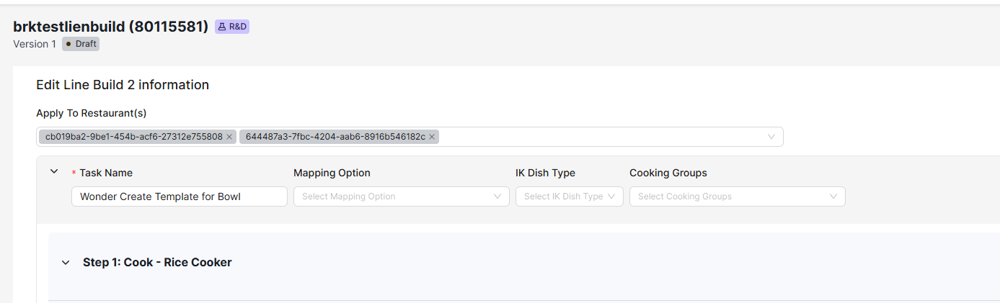
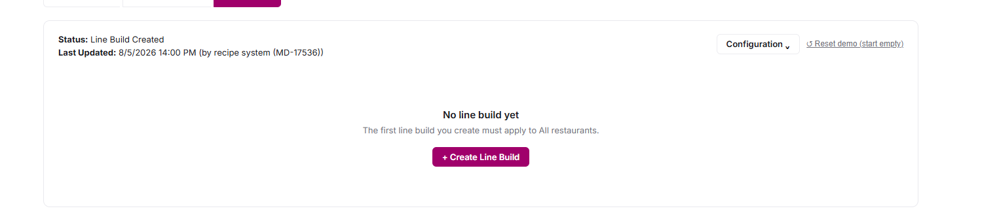
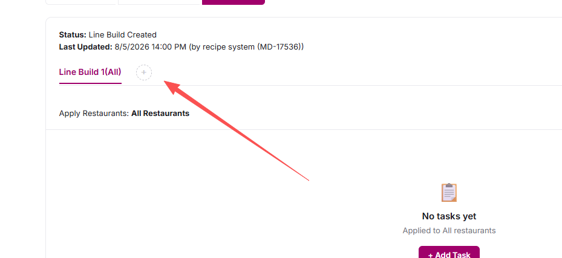

# Front-end Jira Tickets — Sprint 17

> Sprint：`MD 2026 Sprint 17`，周期 **2026-08-10 → 2026-08-24**

## 前端需求拆解

### [MD-18339](https://wonder.atlassian.net/browse/MD-18339)

用新设计重做 Line Build 的 Training Card 导出（PDF）

前端清理一下代码，导出改为后端导出。
---

### [MD-18346](https://wonder.atlassian.net/browse/MD-18346)

给 Customization Option 增加 `Required` 标记，以驱动 Menu Item 置 OOS

> 主 ticket（Epic）：[MD-17762](https://wonder.atlassian.net/browse/MD-17762) Wonder Create Integration
> **时间要求（ticket 原文）**：team 需要它用于 **9/23 pizza launch**，因此「9 月初就要 ready」

**背景**：Chicken Salad 这个 menu item 在鸡肉库存不足时不会显示 OOS（因为其他 customization option 还有货），但业务上主料缺货时该 menu item 就应该不可售。

**需求**

1. 给 customization option 新增 `Required` 标记：
   1. 只适用于 customization type = `mandatory choice`（其中 `none` 选项排除，置灰）
   2. 可在 **main menu item** 和 **preset** 上分别配置
   3. 同一个 customization group 内允许勾选多个 option 为 required
   4. `ineligible` 与 `required` **不能同时勾选**，勾选其一则另一个置灰，并显示 tip
2. 当 max options 不为 null 时，required option 的 portion qty 或 option 数量应 `<= max options`（**ticket 原文标注 TBD**），报错文案：
   - `Unable to save. Required option amount should be <= max options ({value}).`
3. `required` 标记要进 change log
4. copy new item / create new version 时**继承** `required` 标记
5. variant item 版本 Required gray out

---

### [MD-18356](https://wonder.atlassian.net/browse/MD-18356)

保存 line build 时自动清理已失效的 restaurant 引用

> 来源反馈：Slack `https://remarkable-foods.slack.com/archives/C01KS4JM38A/p1785520710104399`

**背景**：menu item 与 restaurant 的关系链是：menu item → 打的 concept → concept 关联 brand → brand 关联 restaurant。这条链上任一环变化，line build 里之前打的 restaurant 就会变成 **UUID** 显示，并**阻断保存**。用户必须手动一个个删掉这些无效 UUID 才能保存，而一个 brand 下可能有很多 restaurant，非常繁琐。

会导致 restaurant 变成 UUID 的操作：
- 从 line build 移除一个 concept
- 从 menu item 所打的 concept 上移除一个关联 brand
- 在 Merch Tool 里把某个 restaurant 从 brand 上移除

**需求**

1. 保存 line build 时，弹窗告知用户该 menu item 已不在某些 restaurant 售卖（**显示 restaurant 名称，不是 UUID**）；用户确认后自动批量移除这些无效引用，并让 line build 正常保存成功
2. 文案：
   - Header：`Invalid Restaurant`
   - 正文：`The main menu item has no longer sold in the below restaurants, is it ok to remove them for saving the line build? Invalid restaurants: {restaurant name1}, {restaurant name2}.`
   - 按钮：`Cancel`、`Yes`

**待确认问题**

1. 全部 restaurant 都失效时的话会变成all
   

2. 弹窗在保存流程里的位置，现在是放在KDS portion 校验的签名

---

### [MD-18347](https://wonder.atlassian.net/browse/MD-18347)

从 Menu Item / 7\* Item 的 component 与 customization 中移除 `Create New Packaged` 功能（代码级清理）

> 主 ticket（Epic）：[MD-18363](https://wonder.atlassian.net/browse/MD-18363) Feature simplify

能清理的代码不多，20几行代码但是测试是需要回归测试的。

---

### [MD-18375](https://wonder.atlassian.net/browse/MD-18375)

在 Line Build 编辑页增加「回到顶部」快捷按钮

> 主 ticket（Epic）：[MD-17264](https://wonder.atlassian.net/browse/MD-17264) @2026 Regular optimization in Cookbook

**背景**：Line Build 编辑页的 step 数量很多，用户要靠长时间拖动 / 滚动才能在其间导航，编辑效率低。

- 在 Line Build 编辑页增加一键「back to top」功能，让用户不必手动滚过所有 step 就能快速回到页面顶部

---

### [MD-18383](https://wonder.atlassian.net/browse/MD-18383)

UI - 允许把整个 customization group 标记为 ineligible

> 主 ticket：[MD-18341](https://wonder.atlassian.net/browse/MD-18341)

**背景**：Cookbook 允许对 main BYO menu item 与 preset 分别配置 customization（ineligible / min options / max options 等），此前有一条「每个 customization group 至少要有一个 eligible option」的校验。而 Wonder Create 项目要求限制顾客把默认选项换成更低成本的选项，因此当某个 group 的所有 option 在某个 preset 里都没被选中时，Cookbook 要能把整个 group 在该 preset 上标记为 ineligible。后端已把「至少一个 eligible option」的下限**从 per-customization 改为 per-menu-item**，服务端不再拦截整组 ineligible。

**需求**

1. **去掉「每个 customization group 至少要保留一个 eligible option」这条限制**，允许把整个 group 的 option 全部标为 ineligible。以下操作都不再做这项校验：
   - 新建 / 编辑 customization（main menu item 侧）
   - 编辑 preset 的 customization
   - 删除 option —— 原本最后一个 eligible option 的删除按钮是禁用的，现在放开
2. **preset 的 customization 表格里，`Ineligible` 勾选框不再被置灰。** 原本的置灰规则是「快要没有 eligible option 时就不让再勾」，分两种：
   - **非 multi-select**：当剩余 eligible option 的数量降到 min options 时，其余仍是 eligible 的行就不能再勾，提示 `The number of eligible options should >= {min options}`
   - **multi-select**：当只剩最后 1 个 eligible option 时，那一行不能再勾，提示 `The number of eligible options should >= 1`
   - 后果是「整组 ineligible」这个状态在界面上永远走不到 —— 例如一个 group 有 3 个 option，勾掉前两个之后第三个就变灰了，卡死在「至少留一个」
3. **校验层级由 group 改为 menu item**：单个 group 全部 ineligible 是允许的；只有当该 menu item / preset 的**所有** featured customization 都没有 eligible option 时才拦下来，报错 `Unable to save. At least one eligible option is required for the entire featured customization.`
4. **保持不变**：已被选中（selected）的 option 仍不能设为 ineligible；min / max options 与 eligible 数量的校验规则原样保留

---

### [MD-18385](https://wonder.atlassian.net/browse/MD-18385)

UI - 调整 Wonder Create Debug Page 的 customization 逻辑

> 主 ticket：[MD-18372](https://wonder.atlassian.net/browse/MD-18372)
> **该 sub-task 与主 ticket 的 description 都是空的**，以下需求来自 2026-08-11 与 RA 的口头沟通 + 后端已合并代码（`origin/develop@2ba40e9281a`）反推，已固化在 openspec `md-18385-wonder-create-debug-v2-page/`
> 后端接口由 MD-18372 提供（Felix / Henry），已合 develop

**背景**：MD-18372 交付了 Wonder Create V2 后端 —— 一套**基于 customization option、支持多 item、异步发布**的新流程，四个接口挂在 `/ajax/wonder-create/v2/*`。前端目前一个都没接。

现有的 debug 页（`src/page/wonderCreateDebug`，MD-18054 交付）接的是 V1，两版契约在 UI 关心的每个维度上都不一样：

**需求**

1. **新页面 `wonder-create-debug-v2`，并把新旧两个页面收进同一个父菜单**
   - 菜单结构从「一个顶层项」改成「一个父菜单 + 两个子项」：`Wonder Create Debug` 下挂 V1 与 V2 两个子页面（容器 route 只写 `children`、不写 `component`，参照 `src/page/attributeV2/route.ts`；Nav 已有 SubMenu 分支，无需改渲染逻辑）
   - **旧页面保留不动**（V1 接口还在线上跑，两版可以对照着调）
   - 复用 V1 的同一个 DevCycle flag `cookbook-enable-wonder-create-debug-page`，一个开关同时放出整个父菜单（不新增 flag、不新增 permission code）
   - 父菜单默认 `hidden`，两个子页面组件内各自再做一次守卫防直接敲 URL；flag 异步 resolve 期间显示 loading 不误跳转（照抄 V1）
2. **Tab：Bowl / Wrap**
   - `item_type` 是 list 接口的**请求参数**，所以切 tab = 重新发请求，不是客户端过滤
   - **有勾选时禁止切 tab**（勾选跨 tab 带不过去，切了就是静默丢弃）；`Add` 会清空勾选，正常流程不会被卡
3. **操作区上移** —— 搜索 / 分类筛选 / 排序 / 已选计数 / `Add` 全部挪到表格**上方**（现在在表格下方）
4. **Options 表格**
   - 列：`PORTION`（可编辑）/ `OPTION`（名称 + 所属 customization）/ `CATEGORY` / `TYPE` / `IMG` / `COST`（food + non-food）/ `NUTRITION` / `ALLERGENS` / `BOM`
   - 搜索改为按 option 名 / customization 名 / category 多 token AND 匹配（V1 是按 item number / name）
5. **待发布列表（新增）**
   - 勾几个 option → 点 `Add` → 生成一条待发布 item，可删、可就地改 external item id / name
   - **列表只显示当前 tab 的，但 `Validate` / `Publish` 发全部（两个 tab 合并成一个 `items[]`，一次请求 = 一个 task）**
   - 因此按钮上标**总数**并显示 tab 拆分，否则列表显示 2 条却发了 5 条会误导
6. **Task 列表（新增）**
   - 每次 publish 成功记一条（`task_id` + 时间 + preview 摘要）；`task_id` 为 null 表示同步就失败了，不记 task 只写日志
   - **纯内存态，刷新即丢**，不限条数
   - 点开抽屉才调一次 `taskStatus`，结果缓存；抽屉里有手动 `Refresh`，**不做轮询**
   - 抽屉正文是 `preview` 与 `taskStatus.items` 按 `external_item_id` join 的表：`external_item_id | change_type | status | item_number | message`

---

### [MD-18401](https://wonder.atlassian.net/browse/MD-18401)

UI - New UX - Line build 分配：强制只有一个 'All' 选项，并提供优雅的切换流程

> 主 ticket：[MD-18392](https://wonder.atlassian.net/browse/MD-18392)
> 本 sub-task 只覆盖 **single version**；multi-usage / multi-version 见 [MD-18397](https://wonder.atlassian.net/browse/MD-18397)

**背景**：Hudson Square 把 Pizza 菜单指向新的 Raw Dough 试点菜单后出现分配问题 —— 受影响的 menu item 上每条 line build 都绑定了具体 restaurant，**没有一条应用到 `All`**，IKC 找不到可兜底的默认 line build。原以为已有护栏保证 `All` 始终存在，实际并没有。

根因是现状把两件事耦在了一起：`Apply To Restaurant(s)` 是 line build 编辑页表单里的一个字段，跟 task 一起保存。于是「这个 menu item 有没有 All」这个问题，只能在每条 line build 各自保存时局部地看，无法在正确的时机整体校验。

目标：
1. 一个 menu item 下**只能有一个** line build 应用到 `All`
2. 有 line build 的 menu item **必须**有一个 `All` line build（不在 IKC 烹饪的 menu item 没有 line build，不受此约束）

**需求**

1. **创建 line build**
  
   - 一条都没有时 → 面板显示空状态 `No line build yet` / `The first line build you create must apply to All restaurants.` + 居中按钮 `+ Create Line Build`；右上角原按钮去掉
   - **第一条恒为 `All`**，没得选所以**不弹窗**，点了直接进编辑页
   - 
   - 已有 line build 时 → 创建入口挪到 sub-tab 末尾的 `+`，点了弹窗选 restaurant，至少选一个才能继续；**提供 `All` 选项**（能不能真存下去交给后端校验）
   - 点确认先调后端 check；不通过则弹窗不关、原地报错
   - **弹窗确认时不创建任何数据** —— 只收集 restaurant，真正的创建发生在编辑页点 Save 时。因此用户在编辑页放弃退出不会留下空的 line build
   - sub-tab 命名由 `Line Build 1` 改为 `Line Build 1(All)`，All 那条带 `(All)` 后缀

1. **编辑 restaurant（解耦出来的独立入口）**
   - 每条 line build 新增 `Assign Restaurants` 入口（作为**外露按钮**，见下面「操作栏重排」），打开弹窗、预填当前 restaurant
   - 可选具体 restaurant 或 `All`；保存时调后端 check，不通过则原地报错
   - **只改 restaurant 归属，不动这条 line build 的 task**
   - 配套：**编辑页里的 `Apply To Restaurant(s)` 全场景置灰** —— create / duplicate / edit 三种进入方式都不可编辑

2. **restaurant 选择器用现有组件**
   - 弹窗里的选择器**不新做**，直接用编辑页现在那个（抽成公用组件），保证两处长得一样、行为一致
   - 现有组件已自带：多选、搜索、已选 tag、一键清空、`All` 选项、HDR 品牌标签、长名 Tooltip、loading 态，以及「选 `All` 就清掉具体 restaurant、选具体 restaurant 就去掉 `All`」的互斥逻辑

3. **编辑页离开时的二次确认**
   - 从新页面进 create / edit 编辑页后，**只要表单动过，离开就弹确认**；没动过则直接走，不拦
   - 覆盖两个出口：`Cancel` 按钮、站内跳转 / 浏览器返回
   - **不做刷新 / 关标签页的拦截** —— `beforeunload` 用不了自定义文案，浏览器强制显示自己的通用对话框，做了也是那个样子；assembly 那个实现同样没做
   - 文案照抄 assembly（`assemblyInstructions/component/AssemblyInstructionIndex.tsx:167-180`）：标题 `Unsaved Changes`、正文 `You have unsaved changes on the form. Are you sure you want to leave?`、确认按钮 `Continue`
   - 脏判断用 `<Form onValuesChange>` 打一个 ref，2 行的事。不会误触发：表单初始化走的是 `form.setFields()`（`useLineBuildForm.tsx:87`），而 rc-field-form 的 `onValuesChange` 只在用户输入路径上触发，`setFields` / `setFieldsValue` 都不触发；页面里其他程序化写值（餐厅互斥、hot hold 回写、KDS 内联错误字段）同理
   - ⚠️ 必须做脏判断，不能"进来就弹"：这个编辑页有 **readonly 模式**（`View Line Build` 走 `?readonly=true` 进的是同一个页面），只是来看一眼的用户退出时弹「你有未保存的修改」是错的；而且每次都弹会训练用户无脑点确认，真有内容那次也照点不误
   - ⚠️ create 模式进来时页面已经自动生成了一个 3 步空脚手架，**不能把脚手架本身当成「改过」**，否则用户点错进来想退出也会被拦

4. **每条 line build 的操作栏重排（只改新 UI，旧 UI 一行不动）**
   - 现状（`lineBuildList/component/LineBuildTable.tsx`）：外面依次是 `View Line Build` / `Training Card` / `Edit Line Build` / `⋮`，`⋮` 里是 `Export to JSON` / `Duplicate` / `Delete`
   - 改为外面留三个：**`View Line Build` / `Assign Restaurants` / `Edit Line Build`**；`⋮` 里是 `Training Card`、`Export to JSON`、`Duplicate`、`Delete`，加上新增的 `Copy from other Line Build`
   - `View Line Build` **不受编辑权限限制、恒在外面** —— `Assign Restaurants` 和 `Edit Line Build` 都要 `canEditByFlag && hasEditLineBuildPermission`，只读用户否则会一个外露按钮都没有
   - `Training Card` 现在是个自带按钮 + 弹窗的组件（`TrainingCard/index.tsx`），收进菜单要把触发器和弹窗拆开，且不能改动旧 UI 的调用形态
   - multi-usage / multi-version 走的旧 UI 保持原样，两套界面在这里故意不一致

5. **从其他 line build 复制 details**
   - `⋮` 菜单新增 `Copy from other Line Build`，二级菜单列出**除当前这条以外**的所有 line build，选中后二次确认「会覆盖当前这条的数据且不可撤销」
   - **只覆盖 task，不改 restaurant 归属** —— 这是它和 `Duplicate` 的根本区别
   - 只有一条时禁用，提示 `No other line build to copy from`
   - 用途：想让 line build 2 的做法成为默认，就把它的 details 复制到本来是 `All` 的 line build 1

4. **Duplicate**
   - 现状：直接跳编辑页，在编辑页里选 restaurant
   - 改为先弹窗分配 restaurant（复用创建那个弹窗），check 通过后跳编辑页、带入复制出来的数据，restaurant 置灰

5. **删除 line build**
   - 现状：无条件可删
   - 点 `Delete Line Build` 先调后端 check，按返回渲染三种结果之一：不允许删（展示后端给的原因）/ 允许删（二次确认）/ 允许删但要指定接班人（弹窗让用户从候选里选一条接管 `All`）
   - 只剩一条时可删（不在 KDS 烹饪的 menu item 本来就不需要 line build）

6. **校验全部由后端驱动**
   - 「有且只有一个 `All`」这条规则**前端不实现**，只调 check 接口 + 渲染返回结果。三个调用点：创建弹窗确认、`Assign Restaurants` 保存、`Delete` 点击

7. **本次只做 single version**
   - 新交互只对 `Is Multi-usage qty Item` 与 `Multi versions vs options` **都关闭**的 item version 生效；任一开启的保持现有界面完全不变（含 `Configuration` 下拉）。新界面上**不展示 `Configuration`**
   - 原因：开了开关的 item version，每条 line build 必须带 scope（`Apply To Option` / `Option Value`）。新创建流程不收集这些字段，让这类 item 走新流程会落下 scope 为空的脏数据或直接被后端拒绝

**待确认问题**

1. **在编辑页刷新怎么办？** 弹窗选的 restaurant 只在前端内存里，刷新就没了。目前方案是退回 Line Build tab 让用户重来（此时他一个字都还没填，损失为零）。若要求刷新后保住选择，弹窗确认时就必须落库，等于回到「会产生空 line build」的模型，要额外做清理逻辑
2. **隐藏 `Configuration` 按钮**： ② 这两个开关是 **item version 维度**（不是 item 维度），
3. 新页面只运行 single version，那同一个 item 切版本时界面会在新旧之间跳（V6 multi / V7 single）③ `Create New Version` 时开关继承吗，若继承则现存 multi item 永远进不了新界面

---

### [MD-18396](https://wonder.atlassian.net/browse/MD-18396)

UI - Concept / Brand 列表页的 Create 按钮位置优化

- 现状：首次打开 Concept / Brand 列表页时看不到 `Create` 按钮（需滚动或其他操作才出现）
- 调整按钮位置，使其在页面首屏即可见

### [MD-18377](https://wonder.atlassian.net/browse/MD-18377)

CLONE - [Tech] 给所有功能补齐 Amplitude 埋点

> 主 ticket（Epic）：[MD-17231](https://wonder.atlassian.net/browse/MD-17231) @2026 Cookbook Technical Excellence

- 上一轮已覆盖导入 / 导出入口，本轮继续排查全站其他关键操作的遗漏埋点

---