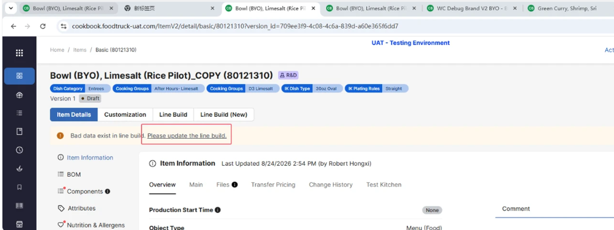

# Front-end Jira Tickets — Sprint 18

### [MD-18465](https://wonder.atlassian.net/browse/MD-18465)

把 template 的改动同步到 brand BYO / presets —— UI 部分

**背景**：CDT 团队只维护一份 Wonder Create Template。Template 的改动要自动同步到 brand BYO item 及其 presets，同时禁止从 brand BYO / presets 上手动改。核心原则：**preset 的默认选项只能由 influencer 改** —— template 的改动（删 option、改 max options）会影响 preset 的既有配置，但**不得自动覆盖**；由 WC Portal 通知 influencer 手动调整，逾期未调整、校验不通过的 preset 由 WC Portal 置 inactive 并从 consumer app 下架。

**前端需求**

1. Delete option / delete customization 改为**只能在 scheduled version 操作**
   1. Confluence Case 4/5 明确标 **Need code change** —— 现状 normal menu item 可以在 active version 删
   2. Final（active）version 上置灰，tip：`Please delete it in future version.`
   3. **不分 normal menu item 还是 wonder create item**
<!-- 2. Final version 上 `Min Options` / `Max Options` / `Ineligible` / `Required` / `Free Options` 置灰，tip：`Please revise it in future version.`；scheduled version 上仍可编辑
   1. 同样不分 normal / wonder create -->
3. `Duplicate Option with Different ID` 确认弹窗（**Confluence 独有，ticket 正文没写**）
   1. 触发：在 **template 的 scheduled version** 里保存 customization/option 时，与 active version 比对**同一个 customization 下**的 option name（大小写不敏感、必须完全一致），name 相同但 UUID 不同
   2. Header：`Duplicate Option with Different ID`
   3. 正文：`Identical options must use the same ID across active and scheduled versions. Is the option below essentially one and the same?`
   4. 展示：`V#（active version）{option name}` & `V#（current scheduled version）{option name}`
   5. 操作：`No` = 关闭弹窗并继续保存；`Yes` = 把 active version 的 option UUID 沿用到 scheduled version
6. 带 `wonder create` concept 的 menu item， **整个 item detail 置为只读**（wonder template 本身除外）
   7. 只读的判定条件 = 后端给的 concept 标识字段 **且** 前端 feature flag 打开
   8. 加 flag 的目的是后续若要放开修改，直接关 flag 即可，不必改代码
9. Bulk swap / bulk edit BOM / customization usages 排除带 `wonder create` concept 的 menu item（**包括 template**）

- 
### [MD-18391](https://wonder.atlassian.net/browse/MD-18391)

Nutrition 卡片展示 `Derived from` 来源，并给不参与营养计算的 WSKU 打 `Unavailable` 标

> UI sub-task [MD-18467](https://wonder.atlassian.net/browse/MD-18467) 

**背景**：40 item 的营养值优先由可用的 41/42 WSKU 计算得出，取不到时才从配对的 `40*F` 继承。但一个 42 item 可能同时满足「没有配置 fulfillment option」+「没有对应的 `W42F` 可继承」+「不是 dormant」—— 它不参与 40 的营养计算，却照样列在 Nutrition 卡片的 Linked WSKU 里，自己的营养数据也不会被清空，于是用户会误以为这行有效。反过来，用户也无从知道当前这份营养值究竟是从哪里算来的。

**需求**

40* 和 `40*F` item detail 的 nutrition 卡片：展示 `Derived from {nutrition source of WSKU1}, {nutrition source of WSKU2}`
 1. 只列**参与计算的那些 WSKU** 
 2. 每个来源都是超链接，跳 WSKU detail 页面
 3. 对**没有参与计算**的 linked WSKU，在 item number 下方显示 **橙色 `Unavailable` chip**
 4. 更新tip：Nutrition of 40*/40*F is calculated from its linked available WSKU respectively. 40* item nutrition is inherited from the paired frozen state 40*F item when no available WSKU linked with it.

### [MD-18454](https://wonder.atlassian.net/browse/MD-18454)

按用户给的表格重置 9\* item 的 `Accounting Type` / `Accounting Sub-Type`

前端这边要更新一下枚举的值

---

### [MD-18455](https://wonder.atlassian.net/browse/MD-18455)

给 line build 加两个字段的 `Label` / `Description`

**背景**：一个 menu item 现在可以有多个 line build，但用户没有直观手段区分它们，管理多套 line build 配置时容易混淆。

**需求**

1. 增加一个 `Line Build Label` 入口：在每个 line build 的 kebab（⋮）菜单里，作为**第一项**，排在 `Export to JSON` 之上
2. 点击后弹窗，字段如下：
   1. Header：`Add Line Build Note`
   2. `Label`：选填，自由文本，上限 5000 字符
   3. `Description`：选填，自由文本，上限 5000 字符
   4. 操作：`Cancel`、`Save`
   5. 超长时内联报错
   6. 成功提示：`Successfully save the line build Note.`
3. hover `Line build #` tab 时展示 `Label`
4. `Description` 展示在 line build header 信息块的**最后一行**（ticket 原文分三种情况写：单版本时在 `Apply to restaurants` 下方，其余在 `Option Value` / `Selected Option value amount` 下方 —— 对照设计稿，三种情况都等价于「排在最后」）
5. 没有 description 时，不展示 `Description` 这一行
6. `Label` 和 `Description` 要进 change log

### [MD-18477](https://wonder.atlassian.net/browse/MD-18477)

edit linebuild 页面 点击step的时候，展开当前task，收缩其他的task

![[Pasted image 20260826105227.png]]

### [MD-18487](https://wonder.atlassian.net/browse/MD-18487)

`[Bug] The jump link is incorrect.` —— item detail 顶部的 line build 报错横幅，点进去落到了旧的 `Line Build` tab

