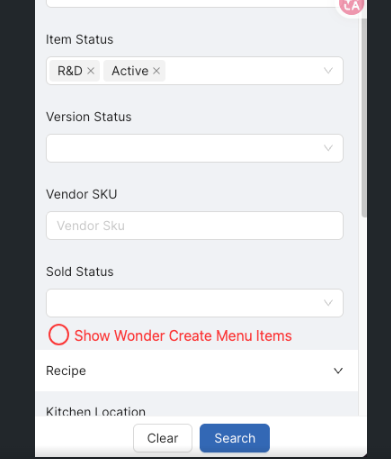
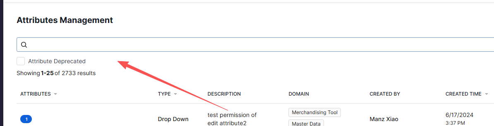
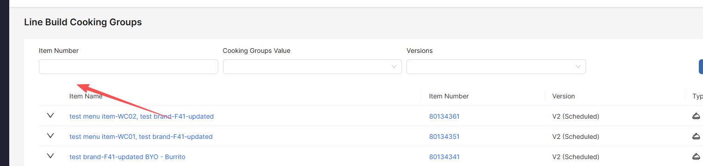

# Front-end Jira Tickets — Sprint 20

> Sprint：`MD 2026 Sprint 20`，周期 **2026-09-21 → 2026-10-05**

## 前端需求拆解

### [MD-18564](https://wonder.atlassian.net/browse/MD-18564)

WSKUs & Consumables 页支持批量 Sync to ERP

**背景**

Finance 需要 Cookbook 把 40/42 item 同步到 ERP。Item Grid 页已有 Sync to ERP，但 42* item 单独放在 WSKUs & Consumables 页，没有入口。这类 item 同步失败后用户无法自助重试，只能等 Cookbook 工程师处理。

**需求**

1. WSKUs & Consumables 页新增 `Sync to ERP` 按钮，位置在 filter 行末尾（`All Filters` / `Status` / `HDR Consumable` 之后）
   - 允许选 41 和 42
   - dormant item 的 checkbox 置灰，tip 文案改为 `Dormant item cannot be selected`
   - 提交后若没有任何 item 可同步（只同步有 final version / SCC 状态为 active 的 41*/42*），报 `Unable to sync to ERP. No available item for syncing to ERP (only sync 41*/42* item which has final version/SCC status is active).`
2. 点按钮后才出现 checkbox 列
   - 勾选任意 item 弹出底部条：`{n} item selected` + `Sync Items to ERP` 按钮，**底部条只有这一个按钮**
   - 点 `Sync Items to ERP` 触发同步
   - 点 `x` 清空所有勾选并关闭底部条；取消全部勾选亦自动关闭
   - 列头出现 all checkbox 支持全选
   - 底部条出现后禁用页面动作：搜索框、`Search`、`Clear`、`All Filters` 及各个 filter 下拉、`Show all filters`、`Columns`、`Create New`、`...`
3. 提交成功提示：`Syncing items to ERP is in process, please see the final result in the Sync Log Job or slack channel 'md-erp-sync-alerts' for final result later.`

### [MD-18588](https://wonder.atlassian.net/browse/MD-18588)

Cookbook 中把 Wonder Create item 与普通 item 区分开

> 主 ticket（Epic: Wonder Create Integration）

**背景**

CDT 希望把 Wonder Create（WC）item 从普通 item 里分离出来。目前 WC item 与普通 item 混在一起，难以识别和单独管理。

**需求**

1. Items grid / Scheduled Changes / Items' attributes list / Line Build Cooking Groups 四个页面默认排除 WC item
   - 加一个 `Show Wonder Create Menu Items` 过滤字段，默认不选。
   - 排除判据是 `wonder_create_external_id != null`，即经 API 由 Wonder Create Portal 创建的
   - template 默认仍然显示 —— template 是手工创建的，`wonder_create_external_id = null`，CDT 需要维护 template 数据
   - Item grid 放在 Show all filters 的 Search Items 弹窗 `General` ；
   - 
   - Scheduled Changes 的 `Items` tab 放在页面 filter 行右侧、`Clear Filters` 左边、
   - 
   - 
2. 在 menu item 名称末尾追加 `Wonder Create` chip
   - template 和 byo 的 menu item 都要加
   - 加在：Item grid 页、Usages、Item details 页、Items' attributes list
3. 40*/7*/9* item 的 usages card 里，BOM usages tab 和 customization usages tab 各加两个 toggle
   - `Exclude Preset Usages`：默认 false。true = 排除所有 preset（普通 preset 和 wonder create preset 都排）
   - `Exclude WC Usages`：默认 false。true = 排除所有 `wonder_create_external_id != null` 的 wonder create menu item
   - `total usages / variant usages` 与 `for sale usages` 三个计数都要按 toggle 过滤后的数据算

### [MD-18574](https://wonder.atlassian.net/browse/MD-18574)

Line build 的 export/import 字段对齐 Duplicate（补 IK Dish Type）

> 主 ticket（Epic: [KDS Support] Line Build & Appliance Settings support）

**背景**

用户反馈：导出再导入 line build 时，subtask 上的 IK Dish Type 丢失。原因是 export/import 一度被认为是即将废弃的低频功能，后续新增的字段只同步进了 Duplicate，没有同步进 export/import。但用户确认仍然需要 export/import —— menu item 有多个版本，而 Duplicate 只能在同一个 menu item 内复制，跨版本搬 line build 只能靠 export/import。

**需求**

1. 让 export/import 与 Duplicate 拷贝同样的字段，包含 subtask 上的 IK Dish Type，然后还要看下 Duplicate 有处理而 export/import 漏掉的字段与逻辑
2. export/import 
   - task 层：IK Dish Type、Cooking Groups
   - sub step：KDS portion flag —— 若 KDS portion 与目标 menu item 匹配则保留该值，否则在 KDS portion flag 上显示 inline error
3. Duplicate 要把 Breaking Line 一起复制到新 line build
4. 解决 之前 import 时 KDS portion 展示错误的 inline error

